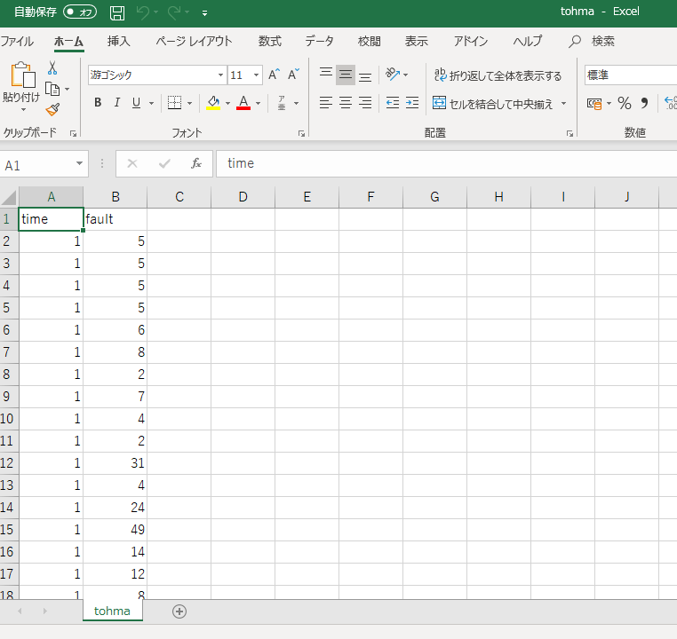
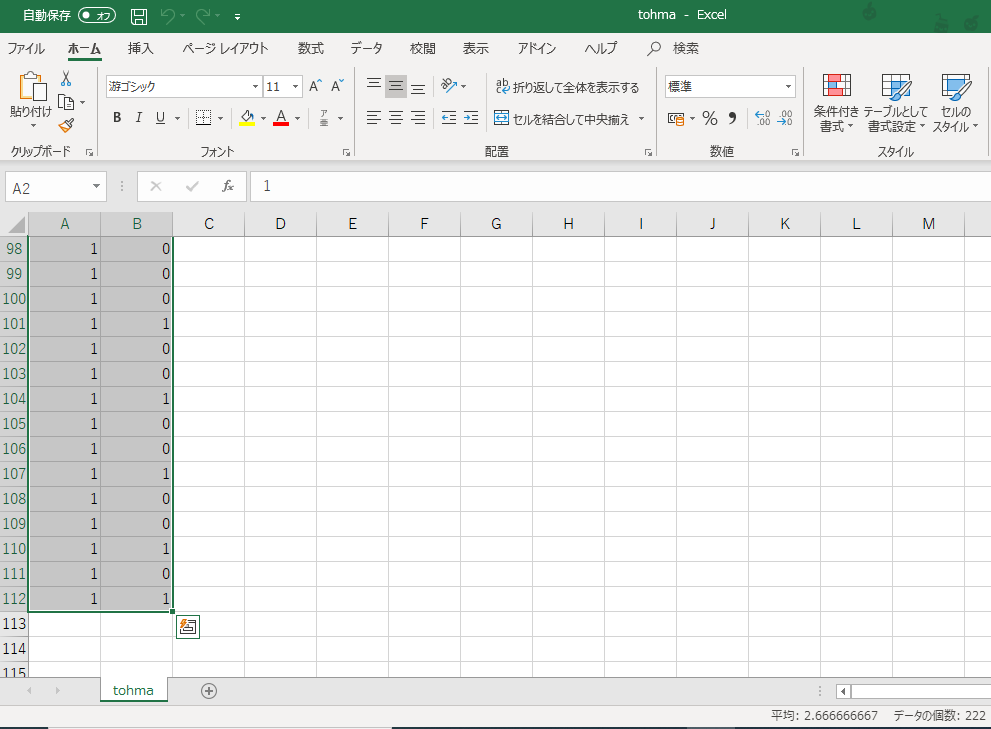
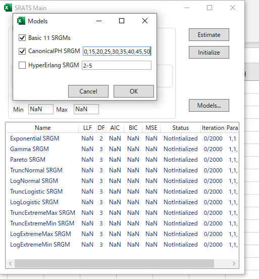
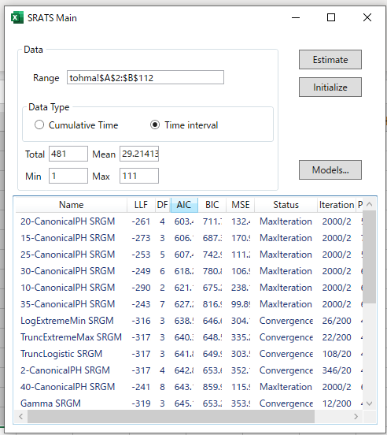
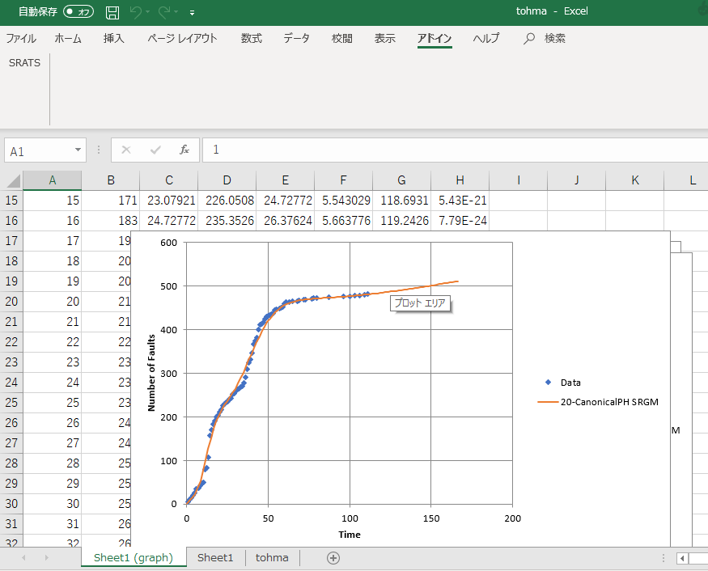
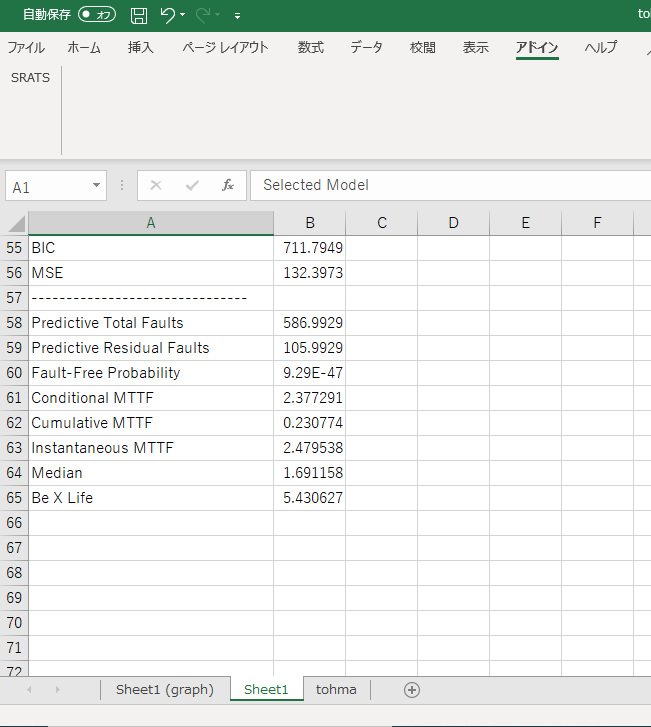

## 利用例

### バグデータ

使用例では実際の開発現場で計測されたバグ発見データを用いた分析例を示します．データは Tohma et al. による約 200 モジュールからなるリアルタイム制御に対するテストで得られたバグ発見個数データであり，111 の観測で 481 個のバグが発見されています．[^1]

[^1]: Y. Tohma, Y. Yamano, H. Ohba and R. Jacoby. The estimation of parameters of the hypergeometric distribution and its application to the software reliability growth model. *IEEE Transactions on Software Engineering*, 17:483-489, 1991.

データは下記のURLからダウンロードできます．`time` 列にはテスト消化時間（1テスト時間），`fault`列にはその時に発見されたバグ数が記録されています（図１）．

[https://raw.githubusercontent.com/rellab/SoftwareFaultData/master/tohma/tohma.csv](https://raw.githubusercontent.com/rellab/SoftwareFaultData/master/tohma/tohma.csv)

### データの選択

SRATS2017では時間間隔，累積時間のいずれも利用できます．先のバグデータのテスト消化時間を時間軸として評価を行います．`time`列と`fault`列におけるデータ部分を選択してSRATSを起動します（図２）．このとき，メインフォーム上では Time Interval を指定します．

### モデルの追加

この例では基本11モデルに加えて標準形位相型分布モデルを追加します．「Models...」ボタンを押し，CanonicalPH SRGM を追加します．追加する位相型分布モデルの位相数は 2, 5, 10, 15, 20, 25, 30, 35, 40, 45, 50 とします（図３）．

### 推定・モデル選択

選択したデータに対してすべてのモデルのパラメータ推定を行います．メインフォームの「Estimate」で推定を行います．推定結果のサマリーのAICを押すと，昇順に並べ替えられ「20-CanonicalPH モデル」が最良になることがわかります（図４）．

### 評価と管理

「20-CanonicalPH モデル」による評価結果を Excel シートへ出力します（図５，図６）．

ここでの評価は
- 現時点で残っているバグが 105.99 個
- 現時点でバグがすべて除去されている確率が 9.29E-47
- 次のバグが発見されるならば 2.38 テスト消化時間後（Conditional MTTF）

と評価されます．テスト管理者はこの指標をもとに追加テストなどの判断を行います．
