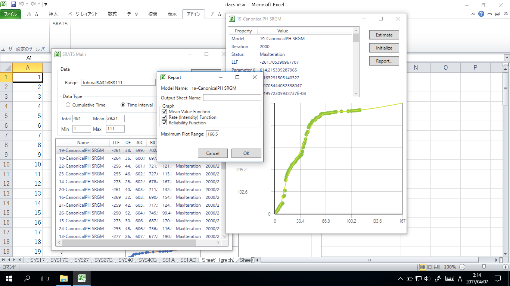

## SRATS2017

### SRATSとは

SRATS (Software Reliability Assessment Tool on Spreadsheet Software) は，ソフトウェアの品質を計測しテスト進捗管理を支援するためのツールです．

SRATS2010までのC++およびXLAアドインによる実装から，C# ならびに VSTO (Visual Studio for Tools) によるExcelアドインとして再記述しています．

旧版のSRATS, SRATS2010を手に入れる場合はこちらのリンクからお願いします（動作環境等の保証はいたしません）．

- [SRATS (2004〜2009)](https://swreliab.github.io/SRATS2010/manual/home.html)
- [SRATS2010 (2010〜2016)](https://swreliab.github.io/SRATS2010/)
- SRATS2017 (2017〜)

SRATS, SRATS2010, SRATS2017 の機能的な特徴を以下に列挙します．
- Excel のフォーム機能によるユーザーインターフェース データの入力はセル選択により行う．
- データ形式は，障害発見時刻，日ごとや月ごとの障害件数，それらの一般化を扱う．
- 1 つのフォールトデータに対して複数のモデルを適用し，フォーム上でAIC, BICによるモデルの適合性比較ができる．
- パラメータ推定作業を完全にマスク（初期パラメータの決定，推定手続き，etc.）する．
- レポート出力機能により，詳細情報とグラフ作成を行う．

### 更新履歴

- 2017/5/26 電子情報通信学会信頼性研究会でSRATS2017を発表（[論文](https://github.com/SwReliab/SRATS2017/blob/master/docs/pdfs/ieice20170526.pdf)）

### SRATS2017における新機能

SRATS2017 で新たに追加された機能を以下に列挙します．
- 位相型モデルの追加
- グラフプレビュー
- モデル推定部分をC#のライブラリとして提供可能
- インストーラの提供

### SRATS2017で扱うモデル

SRATS2017 ではSRATS2010でも扱っていた以下の11種類の基本ソフトウェア信頼性モデル（ソフトウェア信頼度成長モデル）に加えて二種類の位相型分布モデルを扱うことができます．

- 基本モデル
    - Exponential SRGM: 指数分布モデル（Goel-Okumoto モデル）
    - Gamma SRGM: ガンマ分布モデル（遅延 S 字形モデル）
    - Pareto SRGM: パレート分布モデル
    - TruncNormal SRGM: 切断正規分布モデル
    - LogNormal SRGM: 対数正規分布モデル
    - TruncLogistic SRGM: 切断ロジスティック分布モデル（習熟 S 字形モデル，ロジスティック曲線）
    - LogLogistic SRGM: 対数ロジスティック分布モデル
    - TruncExtremeMax SRGM: 切断最大値分布モデル（ゴンペルツ曲線）
    - LogExtremeMax SRGM: 対数最大値分布モデル
    - TruncExtremeMin SRGM: 切断最小値分布モデル
    - LogExtremeMin SRGM: 対数最小値分布モデル（ワイブル分布モデル）
- 位相型モデル
    - CanonicalPH SRGM: 標準形モデル
    - HyperErlang SRGM: 超アーラン分布モデル

各モデルの詳細は以下の PDF ファイルを参照して下さい．

[PDFファイル](https://github.com/SwReliab/SRATS2017/blob/master/docs/pdfs/srats_model.pdf)

### ライセンス

本ソフトウェアのコードはMITライセンスもとづいています．本ソフトウェアの著作権は開発者に帰属します．

### 参考文献

本ソフトウェアは以下の研究成果にもとづいています．

1. 岡村寛之, 渡部保博，土肥正, 尾崎俊治, EM アルゴリズムに基づいたソフトウェア信頼性モデルの推定”, 電子情報通信学会論文誌 (A), vol. J85-A, no. 4, pp. 442-450, 2002.
1. H. Okamura, Y. Watanabe and T. Dohi, Estimating mixed software reliability models based on the EM algorithms, Proceedings of 2002 International Symposium on Empirical Software Engineering (ISESE 2002), 69-78, IEEE CPS, 2002.
1. H. Okamura, T. Watanabe and T. Dohi, An iterative scheme for maximum likelihood estimation in software reliability modeling, Proceedings of 14th International Symposium on Software Reliability Engineering (ISSRE 2003), 479-490, IEEE CPS, 2003.
1. H. Okamura, T. Dohi and S. Osaki, EM algorithms for logistic software reliability models, Proceedings of 22nd IASTED International Conference on Software Engineering, 263-268, ACTA Press, 2004.
1. H. Okamura, A. Murayama and T. Dohi, EM algorithm for discrete software reliability models: a unified parameter estimation method, Proceedings of 8th IEEE International Symposium on High Assurance Systems Engineering (HASE), 219-228, IEEE CPS, 2004.
1. 岡村寛之，安藤光昭，土肥正, 一般化ガンマソフトウェア信頼性モデル, 電子情報通信学会論文誌 (D-I), J87-D-I:805-814, 2004.
1. H. Okamura and T. Dohi, Building phase-type software reliability models, Proceedings of The 17th International Symposium on Software Reliability Engineering (ISSRE 2006), 289-298, IEEE CPS, 2006.
1. H. Okamura and T. Dohi, Hyper-Erlang software reliability model, Proceedings of 14th Pacific Rim International Symposium on Dependable Computing (PRDC 2008), 232-239, IEEE CPS, 2008.
1. K. Ohishi, H. Okamura and T. Dohi, Gompertz software reliability model: estimation algorithm and empirical validation, Journal of Systems and Software, vol. 82, 535-543, 2009.
1. H. Okamura, T. Dohi and S. Osaki, Software reliability growth models with normal failure time distributions, Reliability Engineering and System Safety, 116:135-141, 2013.
1. H. Okamura and T. Dohi, SRATS: Software reliability assessment tool on spreadsheet (experience report), Proceedings of the 24th International Symposium on Software Reliability Engineering (ISSRE 2013), 100-117, IEEE CPS, 2013.
1. H. Okamura and T. Dohi, Phase-type software reliability model: Parameter estimation algorithms with grouped data, Annals of Operations Research, 244:177-208, 2016.

### 問い合わせ

[問い合わせフォーム](https://forms.office.com/Pages/ResponsePage.aspx?id=3VQExGOyJkmGjY4SZA03UIHp3P20ykRKqppQ5eyYCWlUMlNBWU9WOVI1UkFFVkRKNzVQN1dDTjcyTS4u)

