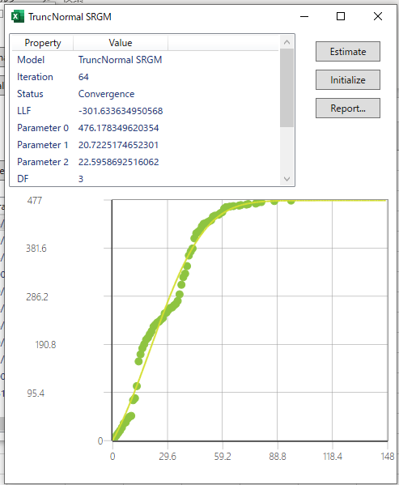

## 利用方法

### 概要

ここでは SRATS2017 の一連の操作方法を説明します．基本的な操作の流れは
- フォールトデータの選択
- SRATS2017の起動
- パラメータの推定とモデル選択
- レポート出力

となります．SRATS2017では基本的な11個のモデル（および位相型モデル）のパラメータをすべて推定しサマリー（summary）で比較しながらモデル選択を行い，最良のモデルのレポートを出力することになります．

以下では，上記操作の順を追って解説していきます．

### データ選択

フォールトデータは Excel のシートから入力形式となります．データ形式は縦方向のセルに時系列のデータとして入力します．SRATS2017 では次の３つのデータ形式を扱えます．

---

#### 障害時間データ

障害時間データは一つの列で表される形式で，障害が発見された時間を一つの列に記述します．下の表は障害時間データの例（時間間隔版，累積時間版）です．時間間隔版の方は，最初の障害がテスト開始後３日目（あるいは ３ CPU 時間など）で発見され，さらに２番目の障害が最初の障害から 33 日後に発見され，以下同様に，先の障害から次の障害発生までの時間間隔を表しています．累積時間版の方は，累積時間で表したもので初期時刻からはかって何時障害が起きたかを表しています．時間間隔版，累積時間版のどちらも１コラムで表現されます．

障害時間データの例（時間間隔）

|時間間隔|
|-:|
|3|
|33|
|12|
|...|

障害時間データの例（累積時間）

|累積時間|
|-:|
|3|
|36|
|48|
|...|

---

#### 障害個数データ

障害個数データは二つの列で表される形式で，一つ目の列には時間間隔または累積時間，二つ目の列にはその時間区間で発見された障害の個数を記述します．最も使いやすい形式と思います．下の表は障害個数データの例（時間間隔版，累積時間版）です．時間間隔版の方は，テスト工数 100 （人日，CPU時間など）に対して 4 件の障害が発見され，次にテスト工数 10 に対して 1 件の障害が発見され，以下同様に，時系列的に実行したテスト工数と発生障害件数を表現しています．累積時間版の方は，時間間隔版の第１コラムを累積時間で表したものです **（障害件数は累積ではないことに注意）** 時間間隔版，累積時間版のどちらも２コラムで表現されます．

障害個数データの例（時間間隔）

|時間間隔|障害件数|
|-:|-:|
|100|4|
|10|1|
|25|0|
|...|...|

障害個数データの例（累積時間）

|累積時間|障害件数|
|-:|-:|
|100|4|
|110|1|
|135|0|
|...|...|

---

#### 時間・個数を含む一般的な形式

一般形は時間データ，個数データのどちらも表現でき，且つ，より詳細な表現が可能です．一列目には時間区間，二列目にはその時間区間で発見された障害の個数，三列目には時間区間の最後で（ちょうどで）障害が発見されたかどうかを 0 （発見されない）もしくは 1 （発見された）で表します．

三列目がすべて 0 の場合は個数データと同じになり，二列目がすべて 0 で三列目がすべて 1 の場合は時間データと同じになります．そのため，C#のモデル推定では，この形式ですべて処理しています（時間・個数データから変換している）．

この形式が必要な典型的な例を下に示します．最後の行を除くとこれは時間データと同じですが，最後の行は最後の障害が発見されてから12時間（日数，CPU時間）経過しているが障害が起きなかったことを示しています．最後に障害が起きなかった時間を考慮することは正確な信頼度推定に影響するので注意してください．

一般形式データの例（時間間隔）

|時間間隔|障害件数|時間区間終わりの障害件数|
|-:|-:|-:|
|3|0|1|
|33|0|1|
|12|0|1|
|...|...|...|
|52|0|1|
|12|0|0|

一般形式データの例（累積時間）

|累積時間|障害件数|時間区間終わりの障害件数|
|-:|-:|-:|
|3|0|1|
|36|0|1|
|48|0|1|
|...|...|...|
|1933|0|1|
|1945|0|0|

すべてのデータの形式は縦方向のセルに時系列のデータとして入力し，第１列目は時間間隔，累積時間のいずれでも対応できます．SRATS2017 のフォーム上で，第１列目が時間間隔の場合は Time Interval，第１列目が累積時間の場合は Cumulative Time を選んでください．

SRATS2017 内で，時間・個数・一般形データの判別は選択した**データの列数**で判断しています．つまり，１列だけ選んだ場合は障害時間データ，２列選んだ場合は障害個数データ，３列選んだ場合は一般形とみなして処理をします．

### 起動

SRATS2017 は Excel 上のアドインとして動作します．データを選択した状態からメニューバーあるいはアドインタブから　SRATS を選択するとメインフォームが表示されます（図１，図２）．このとき，選択したデータが Data の Range に記述されます．メインフォーム起動後に Range を変更することはできないので，変更したい場合は一旦メインフォームを閉じて，シート上の範囲を選択しなおした後に再度 SRATS を起動してください．

### パラメータ推定とモデル選択

選択したデータにモデルをフィットさせるために，パラメータ推定を行います．モデル毎に推定を行うこともできますが，ここではすべてのモデルを推定するためにメインフォームの「Estimate」ボタンを押します．

推定時にプログレスバー等が表示されないので，推定に時間がかかる場合は「応答なし」と表示される可能性がありますが，しばらく待っていれば応答が帰ってくると思います．なお，モデルの初期化と収束判定は自動で行います．初期化は「Initialize」ボタンを押して手動で行うこともできます．

推定が完了するとメインフォームの下部に推定結果のサマリーを表示します．サマリーに表示される内容は以下の通りです．
- LLF: 最大対数尤度
- DF: モデル自由度（自由パラメータ数）
- AIC: 赤池情報量規準
- BIC: ベイズ情報量規準
- MSE: 平均二乗誤差
- Status: モデルの状態
- Iteration: パラメータの更新回数
- Parameter: モデルパラメータ

モデルの状態（Status）は以下の通りです．
- NonInitialized: 最初の状態
- Initialized: データから適切な初期パラメータを決めた状態
- Convergence: パラメータ推定が適切に行えた状態
- MaxIteration: パラメータの更新回数が上限に達した状態

状態が Convergence であればデータに最も合うパラメータが推定できた状態です．MaxIterationはパラメータ推定がきちんと行えていないので，更なる更新が必要であったり，そもそもモデルがデータにフィットしないことを表しています（図４）．

サマリーからモデルを選択し，ダブルクリックすることで詳細フォームを開くことができます（図５）．詳細フォームでは，単一モデルの推定「Estimate」，初期化「Initialize」，レポート出力「Report...」が行えます．また，各モデルで評価した信頼性尺度も表示されます．

推定されたモデルの中から最良のモデルを選びます．サマリーに表示されている AIC または BIC で最小となるモデルが最良モデルとなります．サマリーのAIC等のタブをクリックすると，昇順・降順でモデルを並べ替えることができます．

### レポート出力

SRATS2017 では一つのモデルに対する詳細な結果を Excel シートに出力します．サマリー上でモデルを選択し，メインフォーム画面上の「Report」をクリックするとレポート出力画面が表示されます（図６）．

ここでは結果を出力するシートの名称（空白でもかまいません），平均値関数（期待累積フォールト数）のグラフ作成（Mean Value Function），障害発見率のグラフ作成（Rate Function），信頼度関数のグラフ作成（Reliability Function）を行うかどうかをチェックします．さらに，Maximum Plot Range では，グラフの横軸（時間軸）の最大値の設定ができます．デフォルトでは障害データにおける最大時間の 1.5 倍に設定されます．これらの値を入力後に「OK」ボタンをクリックすることで，シートへの出力を行います．

出力されるシートは２つあり，一つはモデルパラメータや評価尺度を記述したもの（図７），もう一つはグラフとその元となるデータを記述したシート（図８）です．

パラメータシートにおける内容は以下の通りです．

- Total Experienced Failures: データにある総バグ数
- Minimum Failure Time: 最初に発見されたバグの発見時間
- Maximum Failure Time: 最後に発見されたバグの発見時間
- Mean Failure Time: データ上の全てのバグの発見時間の平均
- The Number of Parameters: モデルパラメータ数
- Degrees of freedom: モデルの自由パラメータ数
- Parameter x: 推定されたパラメータ値
- Status: モデル状態
- Iteration: パラメータ更新回数
- Maximum Log-Likelihood: 最大対数尤度
- AIC: 赤池情報量規準
- BIC: ベイズ情報量規準
- MSE: 平均二乗誤差
- Predictive Total Faults: 予測される総バグ数
- Predictive Residual Faults: 予想される残存バグ数
- Fault-Free Probability: 現時点でバグが0である確率
- Conditional MTTF: 次のバグが発見されるまでの平均時間（FAQを参照）
- Cumulative MTTF: 次のバグが発見されるまでの平均時間（FAQを参照）
- Instantaneous MTTF: 次のバグが発見されるまでの平均時間（FAQを参照）
- Median: 信頼度が0.5になる時間
- Be X Life: 信頼度が0.1になる時間

グラフシートにあるグラフ（上から順）は以下の関数をプロットしています．

- Mean Value Function: 平均値関数．ある時刻までに期待される発見バグ数．バグ曲線とか信頼度成長曲線として引用されていることが多い．
- Reliability Function: 信頼度関数．その時刻までにバグが発見されない確率
- Intensity Function: 強度関数．平均値関数を時間微分したもの．つまり，平均値関数の増加率．その瞬間でのバグ発見率を表す．

### 位相型分布モデルの追加

SRATS2017では基本11モデルに加えて2種類の位相型分布モデルを追加することができます．メインフォームの「Models...」を押すと位相型分布モデルに関する次のフォームが現れます．

標準形位相型分布モデルを追加する場合は CanonicalPH SRGM にチェックをつけ，超アーラン分布モデルを追加する場合には HyperErlang SRGM にチェックをつけます．各モデルの横にあるボックスは位相数を入力する蘭であり，2-20 のように記述すると位相数2から20までの19個のモデルが追加されます．また，2,5,10 のような表記もでき，この場合は位相数 2, 5, 10 の三つのモデルが追加されます．

位相数が多いほどモデルパラメータが増えるためデータによりフィットするようになりますが，推定に時間がかかるようになります．またデータへの過適合が生じるのであまり高い値を設定するのは避けてください．特に，HyperErlang SRGMで位相数を増やすと総当たり的に推定を行うため推定時間が指数的に増えます．計算能力的に CanocalPH SRGM では 50 くらいまで，HyperErlang SRGM では 15 くらいまでだと考えてください．
